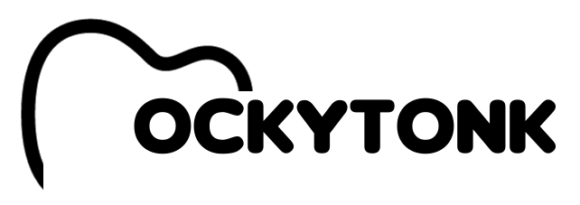
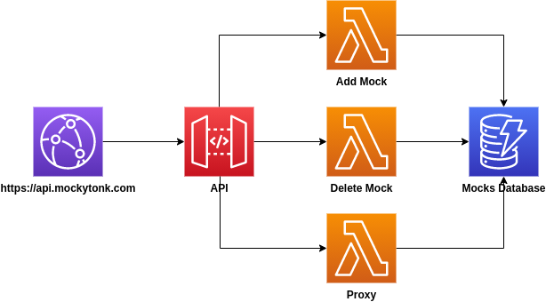

# Mockytonk



**Mocking easy like listening your favorite song**

Mockytonk is a service and also an open-source application to create mocked APIs easily.

## Using

To create your mocked API is easy using our free service:
```bash
curl -X POST https://api.mockytonk.com/mock -d '{"statusCode": 200, "response": { "message": "Hello World!" }, "headers": { "X-Test": "Token" }}' -H 'Content-Type: application/json'
```
The response is something like that:
```json
{"mockContract": {"statusCode": 200, "response": {"message": "Hello World!"}, "headers": {"X-Test": "Token"}}, "id": "5691be86-5226-466c-9115-1cda88e13e07", "secretKey": "f0467c90-18cf-49bf-8b72-8d0abd352a6b", "url": "https://api.mockytonk.com/proxy/5691be86-5226-466c-9115-1cda88e13e07"}
```

Invoke using the URL received in the previous response:
```bash
curl https://api.mockytonk.com/proxy/5691be86-5226-466c-9115-1cda88e13e07
```

### Secret Key

The secret key is the way to secure your mocks. It's an optional parameter. If you don't set a secret key, we create one automatically.
But, if you want to use a specific secret key, you just need to set in your request body, just like that:

```bash
curl -X POST https://api.mockytonk.com/mock -d '{"statusCode": 200, "response": { "message": "Hello World!" }, "headers": { "X-Test": "Token" }, "secretKey": "f0467c90-18cf-49bf-8b72-8d0abd352a6b"}' -H 'Content-Type: application/json'
```

### Delete

To delete a mock you must use both ID and Secret Key:
```bash
curl -X DELETE https://api.mockytonk.com/mock/5691be86-5226-466c-9115-1cda88e13e07/f0467c90-18cf-49bf-8b72-8d0abd352a6b
```

## Curiosity

The name Mockytonk is inspired on Honky Tonk, because the creator (@epiresdasilva) is a big fan of country music.

## Architecture

Mockytonk is designed to be serverless. You will pay only for what you really use. Also, your mock API will scale up as you need.

The architecture is pretty simple. Some lambdas to do basic operations. The DynamoDB is our database, choosen to scale fast as the Lambda needs.

Receiving the requests we have the Cloudfront with edge-optimization and API Gateway for our endpoints.



## Deploy

You can deploy in your own AWS account. To do that is simple.

```
npm install
sls deploy --stage dev
```