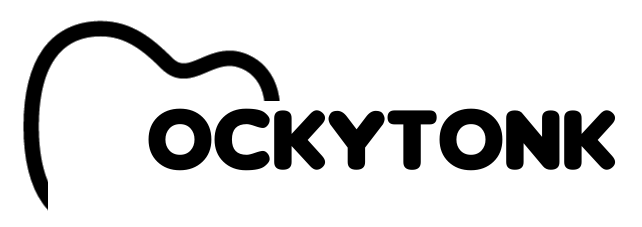

# Mockytonk



**Mocking easy like listening your favorite song**

Mockytonk é um serviço SaaS e também um projeto open source para criar mock de API de forma fácil.

## Usando

Para criar sua Mock API é simples usando nossa api grátis: 

```bash
curl -X POST https://api.mockytonk.com/mock -d '{"statusCode": 200, "response": { "message": "Hello World!" }, "headers": { "X-Test": "Token" }}' -H 'Content-Type: application/json'
```
A resposta será algo como:
```json
{"mockContract": {"statusCode": 200, "response": {"message": "Hello World!"}, "headers": {"X-Test": "Token"}}, "id": "5691be86-5226-466c-9115-1cda88e13e07", "secretKey": "f0467c90-18cf-49bf-8b72-8d0abd352a6b", "url": "https://api.mockytonk.com/proxy/5691be86-5226-466c-9115-1cda88e13e07"}
```

Faça a requisição usando a URL da resposta da requisição:
```bash
curl https://api.mockytonk.com/proxy/5691be86-5226-466c-9115-1cda88e13e07
```

### Secret Key

A Secret Key é o jeito de fazer a segurança dos mocks. É um parâmetro opicional. Se você não passar na requisição um código será criado automaticamente. Mas, se quiser usar uma chave específica, você só precisa passar isso no corpo da requisição, como abaixo:

```bash
curl -X POST https://api.mockytonk.com/mock -d '{"statusCode": 200, "response": { "message": "Hello World!" }, "headers": { "X-Test": "Token" }, "secretKey": "f0467c90-18cf-49bf-8b72-8d0abd352a6b"}' -H 'Content-Type: application/json'
```

### Deletar

Para deletar um mock você precisa passar o ID e a Secret Key:

```bash
curl -X DELETE https://api.mockytonk.com/mock/5691be86-5226-466c-9115-1cda88e13e07/f0467c90-18cf-49bf-8b72-8d0abd352a6b
```

## Curiosidade

O nome Mockytonk é inspirado em Honky Tonk, porque o criador desse projeto (@epiresdasilva) é um grande fã de música country.

## Arquitetura

Mockytonk foi desenhado para ser serverless. Você vai pagar apenas pelo o que de fato utilizar. Também, seus APIs mock terão escalonamento automático conforme precisar.

A arquitetura é bem simples. Algumas funções Lambda fazem as operações básicas. O DynamoDB é o nosso banco de dados, escolhido para escalar rápido conforme o Lambda precisa.

Para receber as requisições temos o Cloudfront otimizado no edge e o API Gateway para os endpoints.


## Deploy

Você pode fazer o deploy na sua própria conta da AWS. Para fazer isso é simples:

```
npm install
sls deploy --stage dev
```